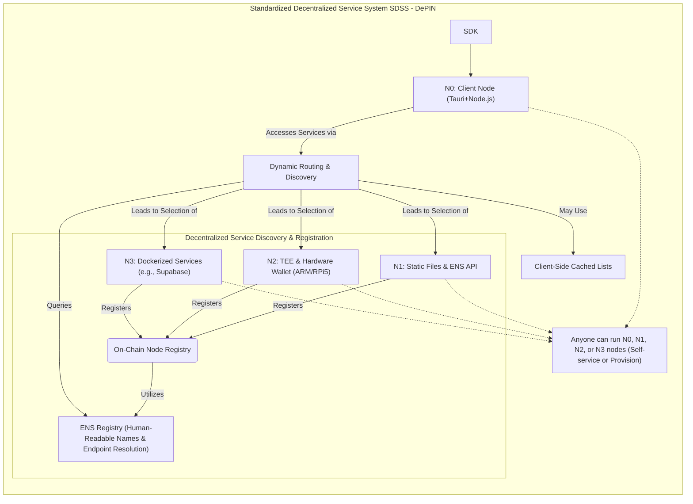

# SDSS(Rain Computing/Edge Computing)
我们讨论到了平台垄断的核心要素：社区诉求、互联网和移动互联网发展，以及资本逐利，当社会有需求，哪怕是苗头，也会有风险资本尝试验证这个逻辑：我们建立一个平台，通过互联网（移动互联网）技术来满足之前无法满足的需求，例如美团。 而平台的垄断会带来超额利润，资本的自我增殖最喜欢的模式：互联网模式就一个个出现和复制。更多在 [平台垄断和协作创新](https://github.com/AAStarCommunity/research/blob/main/blog/economics/Monopoly%26Cooperation.md)

本文认为，世界在变化，互联网模式的垄断正在被打破，或者**有可能被协作创新打破**。因为互联网的技术和产品发展带来的信息平权（相对），而算力的持续增长和AI的加速发展，带来的计算平权（相对）和知识+能力平权（相对），区块链带来的共识平权（任何人都可以建立一个共识，认可的人加入即可）。
当然还有很多其他因素，例如社会层面个体的自我觉醒（背后是社会和经济发展带来的），世界的多元和复杂，人类带给地球负担的加剧（气候变化、环境污染、资源枯竭等），人类文明的多元性相处问题（民族，文化，冲突，战争等等）。
以上是SDSS/Rain Computing提出的背景：互联网平台有可能会被打破，而我们拆解的几个要素，其中云计算是过去经济模型的技术核心：提供服务的同时也垄断了数据和计算能力，替代云计算的是雨计算：SDSS/Rain Computing，未来协作创新的基石之一。

## SDSS/Rain Computing
AAStar尝试构建初始化版本的SDSS0.1版。

### 对比和定义
云计算是一种通过互联网提供计算服务（包括服务器、存储、数据库、网络、软件、分析和智能等）的模式。它允许用户按需访问和使用这些资源，而无需拥有和维护自己的物理基础设施。
雨计算是SDSS/Rain Computing的简称，是云计算的替代品，通过互联网提供计算服务，但不垄断数据和计算能力。
同样提供计算服务：包括服务器、存储、数据库、网络、软件、分析和智能等。
同样按需访问和使用：用户按需访问和使用这些资源，而无需拥有和维护自己的物理基础设施。
### 改变和提升
无数据垄断：但没有了数据垄断带来的服务垄断，所有数据被加密，归属于个体用户和数据提供者，服务提供者。
无计算垄断：所有边缘计算的提供者是竞争和协作关系，在底层经济模型激励下互相备份，互相协作也互相竞争。
无服务垄断：基于去中心的计算能力，以及区块链的共识，服务提供者可以基于共识建立服务，这种共识是去中心的，可替代的，竞争的。

### V0.1
核心组件
1. 节点体系
   - **N0 (Client Node):** Cross-platform client applications (developed with
     Tauri+Node.js) that access services provided by N1-N3 nodes.
   - **N1 (Foundation Service Node):** Provides static file hosting and Ethereum
     Name Service (ENS) resolution API services.
   - **N2 (Secure Compute Node):** Offers TEE (Trusted Execution Environment)
     and hardware wallet services, leveraging ARM-based platforms (e.g.,
     Raspberry Pi 5B).
   - **N3 (Application Service Node):** Runs containerized services (e.g.,
     Dockerized Supabase instances) for broader application support.
2. SDK
3. API和数据标准
4. 配套硬件
5. 链上合约

### V0.1服务能力
Restful API服务和中心化的API没有太大区别，但底层机制有很大的不同，包括通信、加密、解密、验证、发行、竞价、失败、最终一致性、CU支付、声誉体系等。
核心服务能力包括：
#### 节点注册和服务发现
    **Decentralized Service Discovery and Registration:** This mechanism
   underpins the dynamic operation of the SDSS:
   - **ENS Registry for Service Discovery:** Leverages the Ethereum Name Service
     (ENS) for human-readable naming (e.g., `node.ethpaymaster.eth`) and robust
     service endpoint resolution. Nodes register API endpoints and metadata
     within ENS records, creating a decentralized alternative to centralized
     registries.
   - **Node Registration Mechanism:** Provides a secure, potentially
     pseudonymous (via blockchain address) on-chain registry. Nodes register
     their service capabilities, API endpoints (linked via ENS), and public
     keys. This process may involve staking collateral (e.g., into a
     SuperPaymaster contract) to ensure accountability and security.
   - **Dynamic Routing and Discovery:** Client applications (N0 or dApps)
     dynamically locate suitable API service nodes by querying the ENS-based
     registry (e.g., `api.aastar.eth`) or through client-side cached lists. This
     enables self-maintenance of service records, facilitates failover, and
     allows for node selection based on criteria such as reputation or network
     proximity.

#### 核心服务
包括配置和定义，API要遵守各个业务共识的定义，数据结构和返回值要遵守各个业务共识的定义。
业务定义是服务的基础，由协议共识后定义和维护。提供链上和在线版本。
不同服务由不同的软硬件要求。
#### 服务竞价
设定范围，保障服务，提升在线率和成功率，从而提升reuptation，获得更高概率的选中。

#### 服务支付
所有支付使用SDSS积分体系
#### 服务声誉
动态声誉体系，基于服务质量和用户反馈，动态调整。

#### 服务最终一致性
早期提供监控和修复机制，后台自动运行和发行不一致，确保服务最终一致性。

#### 服务失败处理
提供失败处理机制，同样基于监控体系，包括重试、补偿、回滚等，确保服务失败处理的可靠性。
但这些事最终一致性，一般高层业务会自动重试。

#### 服务监控
提供监控机制，包括服务状态、性能、资源使用等，确保服务监控的可靠性。

### V0.1底层组件
1. Node Registry
2. CometENS
3. HexagonWarrior
4. SDSS SDK
5. SDSS Contract

### Defination
1. root ENS domain is a open source organization mark. Like aastar.eth
2. second level is for different services, like paymaster.aastar.eth, airaccount.aastar.eth, etc.
3. third level is free to register for different service providers, like jason.paymaster.aastar.eth
4. for specific service, we have different request and response structure in json.
5. we have collection request and single request to service portal and single service provider.
6. we have reputations in collection request response.

### Example in SuperPaymaster
1. DApp send a request to paymaster.aastar.eth to get a collection of services
   maintained by AAStar(anyone can use CometENS,SuperPaymaster and more to
   create a service like this in different level)
2. Or DApp send to a single paymaster service like jason.paymaster.aastar.eth
   maintained by AAStar and service provider.
3. You will get a 15 minutes fresh service list or a single service description
   including service provider, support ERC20 tokens, sponsor price, reputation,
   and Web2 domain or IP.
4. Choose the favor price or reputation you like to invoke the service to get
   the gas payment signature and send your transaction to be on-chain.
5. The server side include some service relay (bundler and paymaster service) for specific business target.
6. The service supplier will get the gas payment and deduct the PNTs from your
   AirAccount which pre-approved in creating AirAccount by EIP 777 operator.
